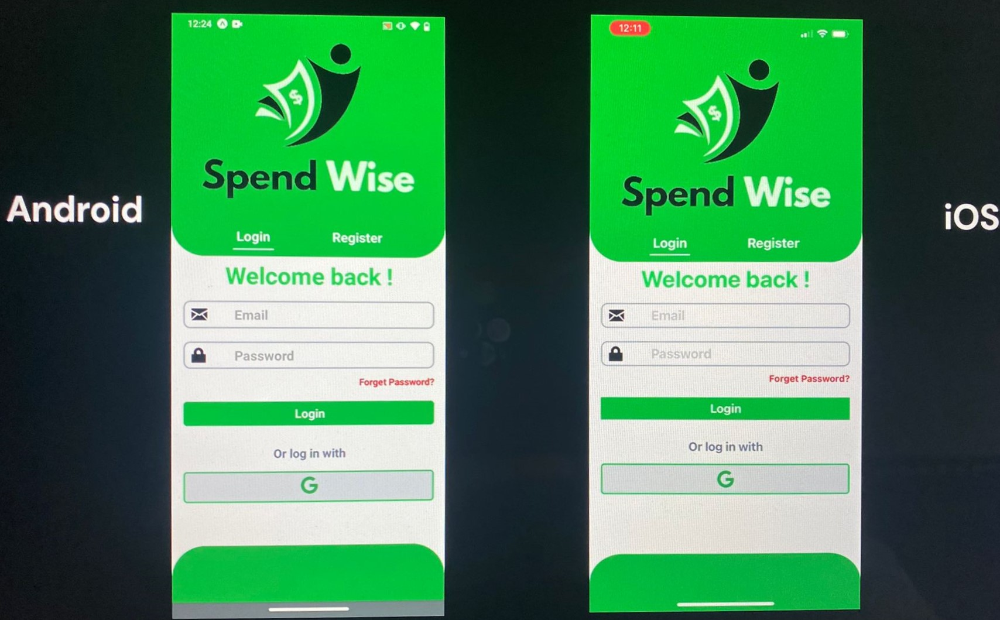
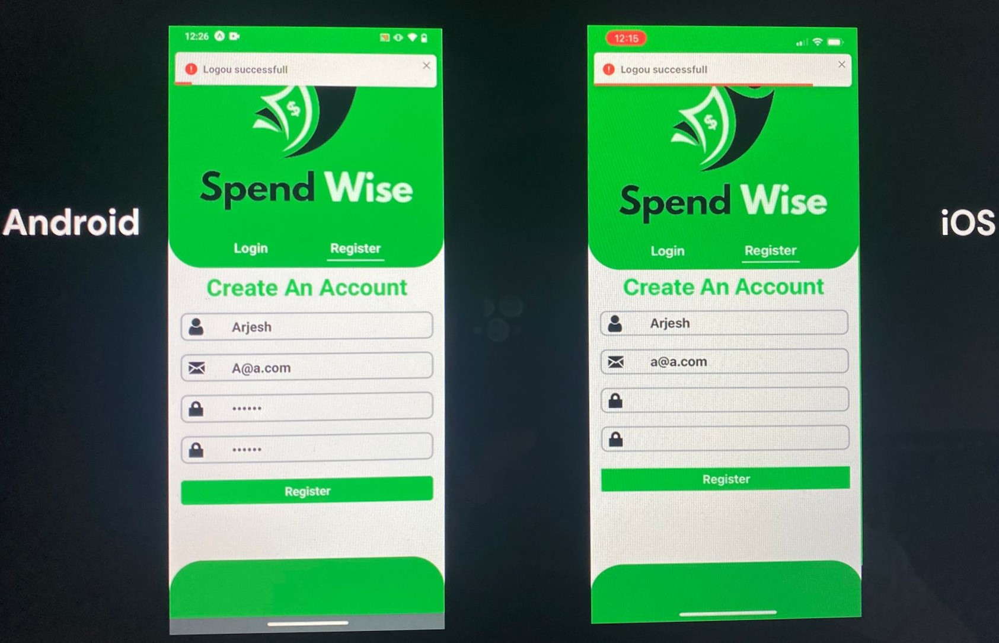
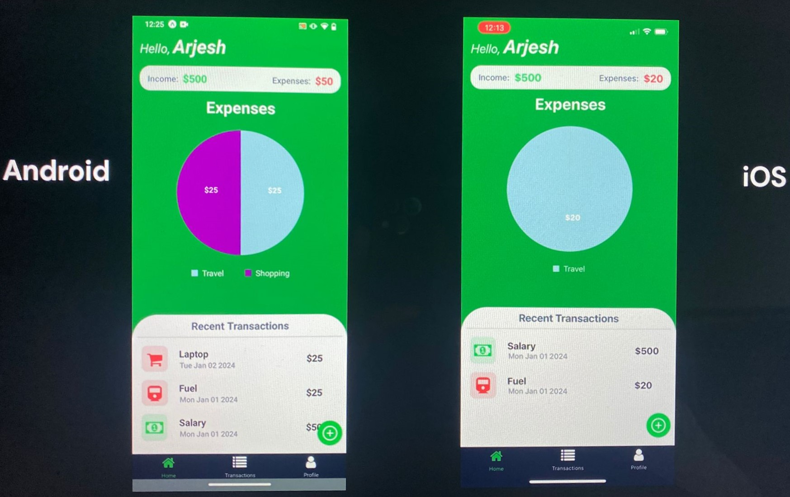
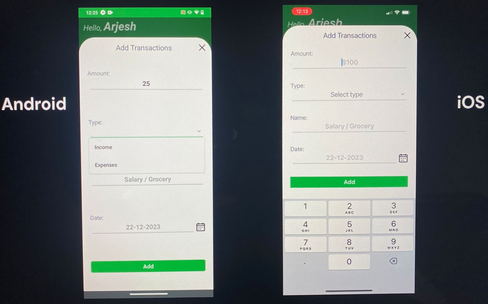
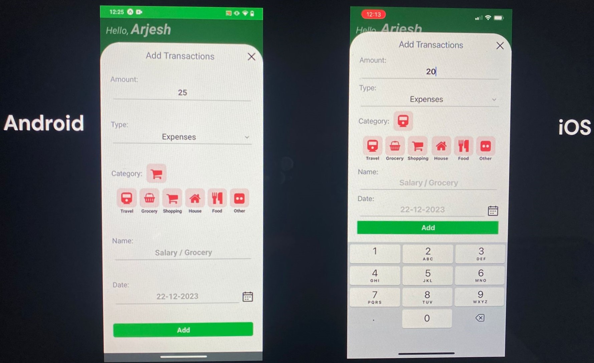
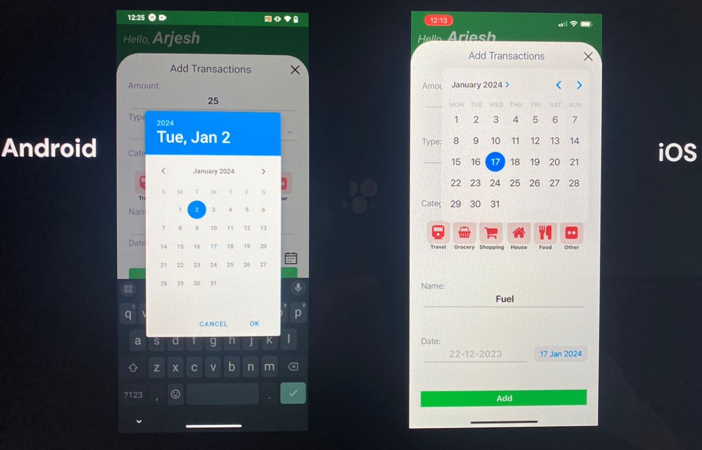
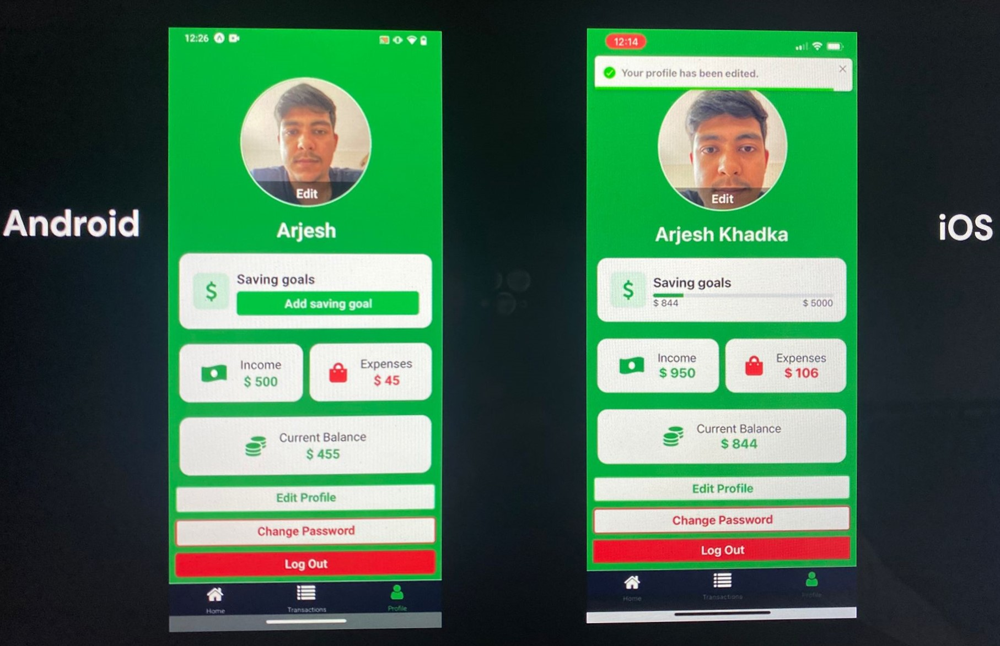

# SpendWise - Personal Finance Management Mobile Application.

## Overview

ShoeTrek is a finance management mobile application. This project shows all my kill in mobile application development and my ability to build a strong and responsive user interfaces.
   
<b>SpendWise Login and Register</b>
<div align="center">


</div>
<br/>

<b>SpendWise Dashboard</b>
<div align="center">

</div>
<br/>

<b>SpendWise Add Transaction</b>
<div align="center">
   
   
   
</div>
<br/>

<b>SpendWise Profile</b>
<div align="center">

</div>


## Technologies Used

I have employed a range of modern technologies to build this project:

* **React Native:** Used for building the mobile application.
* **React:** The core library for building the user interface.
* **Redux Toolkit:** Provides efficient and optimized state management.
* **React Redux:** Connects React components with the Redux store.
* **Expo:** Helps in building and deploying the React Native application.
* **Axios:** Used for making HTTP requests to external APIs.
* **React Navigation:** Used for navigating to different screens.

## Client-Side Features
* **Expense Tracking with Charts:** Visualize your spending patterns and gain insights into your financial habits.
* **Recent Transactions at a Glance:** Easily view and manage all your transactions, sorted with the latest ones first.
* **Saving Goals & Progress Tracker:** Set financial targets, track your progress, and achieve your saving goals.
* **Profile Personalization:** Add a personal touch to your profile with pictures from your gallery or snap a new one using your camera.
* **Profile Editing & Password Management: :** Effortlessly update profile details, change passwords, and ensure your account is secure.
* **Login & Register:** A seamless entry into the world of SpendWise, making your financial journey hassle-free.
* **Add/Edit Transactions with Category Icons: :** Categorize your transactions easily with visually distinct icons.

# Getting Started 

Follow these instructions to get a copy of the project up and running on your local machine.

## Prerequisites

* Node.js
* npm or yarn
* Expo App on your Phone

### Installation

1. **Clone the Repo**

   ```bash
   git clone https://github.com/Arjesh1/SpendWise-React-Native.git

   ```

2. **Install Dependencies**

   ```bash
   npm install

   ```

5. **Start the Server**

   ```bash
   npm start
   ```
   
4. **Scan the QR displayed:**

   * Scan the QR code displayed on the terminal from your camera if Android. or
   * Scan the QR code from the expo app if iOS.


   
